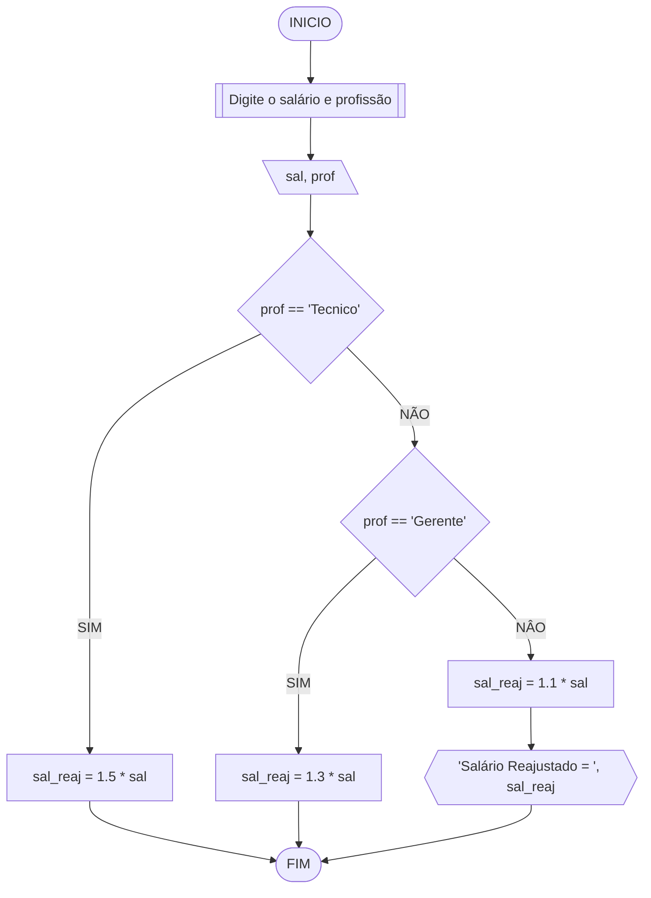

# UNIFOR

**Disciplina**: Raciocínio lógico algorítmico <br>
**Orientador**: Prof. Me. Ricardo Carubbi <br>

**Tema:** Construção de fluxogramas em markdown <br>
**Referência:** [Mermaid Flowcharts - Basic Syntax](https://mermaid.js.org/syntax/flowchart.html)

## Exercício exemplo
Represente, em fluxograma e pseudocódigo, um algoritmo para calcular o adicional de salário de funcionário por cargo de uma empresa fictícia. Sabe-se que os funcionários de cargo técnico receberão reajuste de 50%, cargo de gerência, um reajuste de 30% e demais, um reajuste de 10%. 

### Fluxograma

### Pseudocódigo
```
1  ALGORITMO calReajuste
2  DECLARE  sal, sal_reaj: real, prof: caractere
3  INICIO
4  LEIA sal, prof
5  ESCOLHA
6      	CASO prof == “Técnico”
7           sal_reaj ← 1.5 * sal
8 			CASO prof = “Gerente”
9  					sal_reaj ← 1.3 * sal
10 			SENÃO
11      sal_reaj ← 1.1 * sal
12  FIM_ESCOLHA
13  ESCREVA “Salário Reajustado = “, sal_reaj
14  FIM
```
