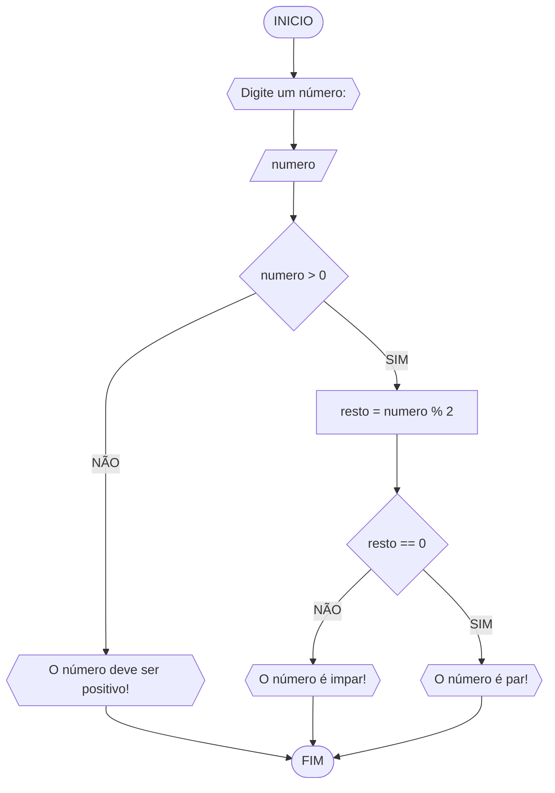

# UNIFOR
**Disciplina:** Raciocínio lógico algorítmico <br>
**Orientador:** Prof. Ricardo Carubbi

## Lista 1 de exercícios

### Exercício 03
Represente, em fluxograma e pseudocódigo, um algoritmo para determinar se um número inteiro e positivo é par ou impar.

#### Fluxograma



```
ALGORITMO verifica_par_impar
DECLARE numero, resto INTEIRO
ESCREVA "Digite um número:"
LEIA numero
SE numero >= 0 ENTAO
	resto = numero % 2
	SE resto == 0 ENTAO
		ESCREVA "O número é par!"
	SENAO 
		ESCREVA "O número é impar!"
SENAO
	ESCREVA "O número deve ser positivo!"
FIM_ALGORITMO
```
